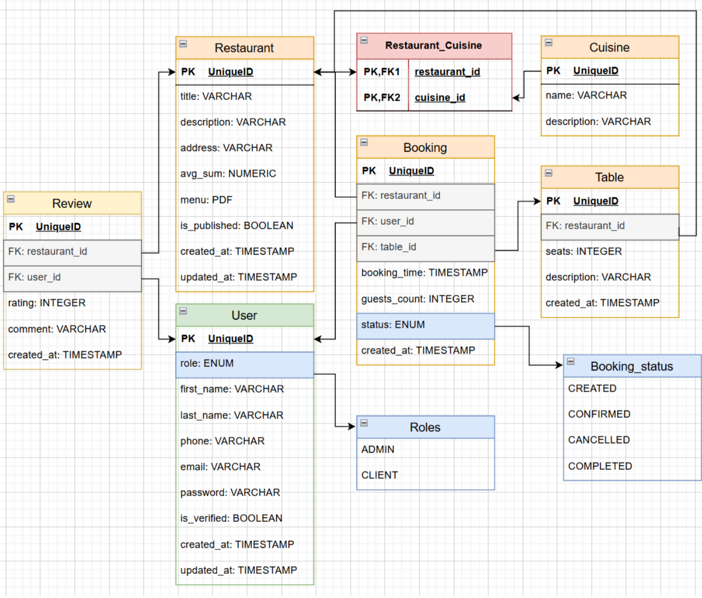

# Api для бронирования столиков

Монолитное приложение было разделено на 5 микросервисов.
Каждый микросервис реализует свою область ответственности и взаимодействует с другими через REST API(webclient)
и Kafka(notification service). Для управления событиями и обеспечения надежной доставки используется Outbox Pattern, 
а обработка событий выполняется с идемпотентностью через проверку UUID события.

В качестве веб-сервера и API Gateway используется Nginx,
который маршрутизирует запросы к соответствующим микросервисам и передает JWT-токены для аутентификации через Keycloak.
Keycloak выступает в роли identity provider, обеспечивая OAuth2-авторизацию и разграничение ролей пользователей.

---

### Стек использованных технологий

```
Java 17
Spring Boot 3.2.5
PostgreSQL
Apache Kafka 4.2.0
Keycloak 26.0
Nginx
Docker
JUnit 5
Maven
Liquibase
MapStruct
Lombok
OpenAPI/Swagger
```
---

### Функциональные требования
1. Управление пользователями (регистрация, авторизация, роли).
2. Управление ресторанами и столами (CRUD операций).
3. Управление бронированиями (создание, подтверждение, проверка доступности).
4. Управление отзывами пользователей о ресторанах.
5. Уведомления о событиях (подтверждение бронирования, регистрация пользователя)
6. Интеграция через API Gateway (Nginx) для унифицированного доступа к сервисам.

---

### Нефункциональные требования
1. Безопасность: OAuth2/JWT через Keycloak, разграничение прав доступа (ROLE_ADMIN, ROLE_USER).
2. Event-driven архитектура с Kafka для асинхронного обмена сообщениями.
3. Синхронное общение между сервисами через WebClient
4. Outbox Pattern для гарантированной доставки событий.
5. Идемпотентность: сохранение обработанных событий в Outbox для предотвращения дублей.
6. Документация: Swagger/OpenAPI для всех микросервисов.

--- 

### Схема базы данных для монолитного приложения



---
